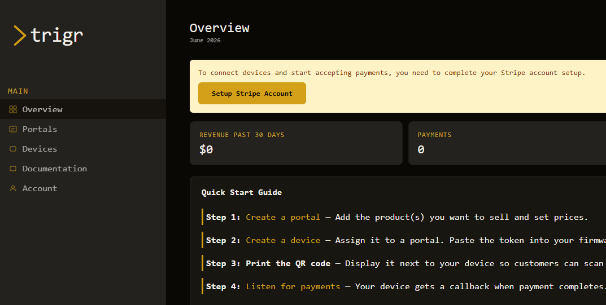
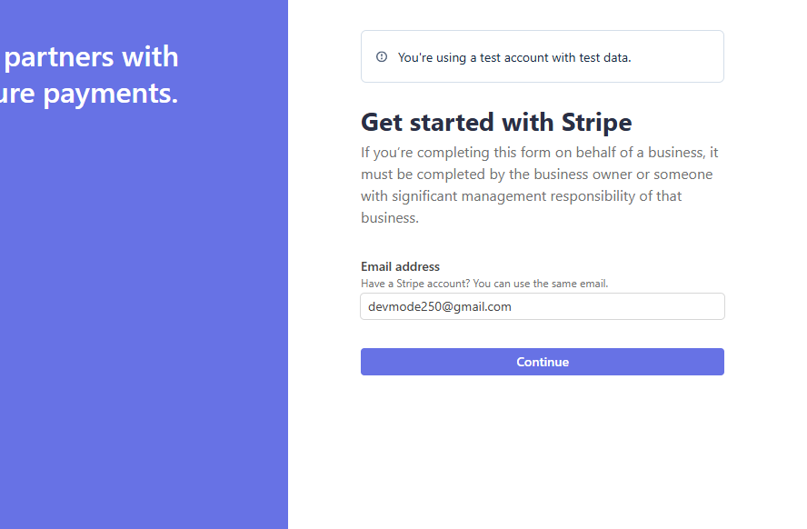
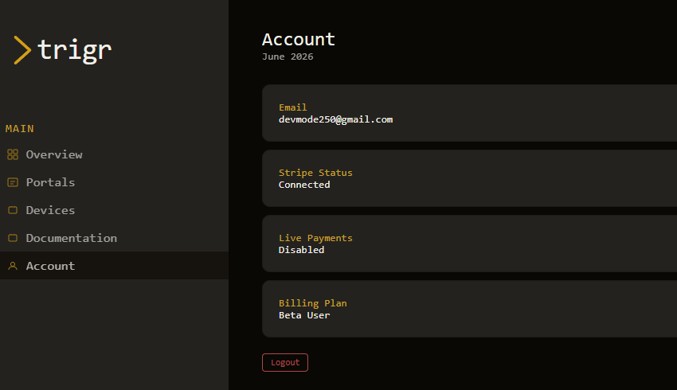
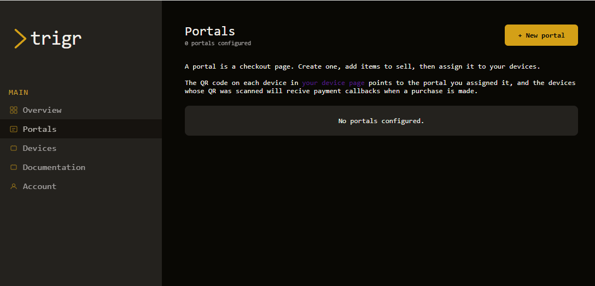
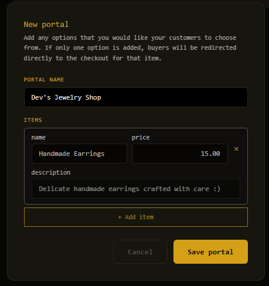
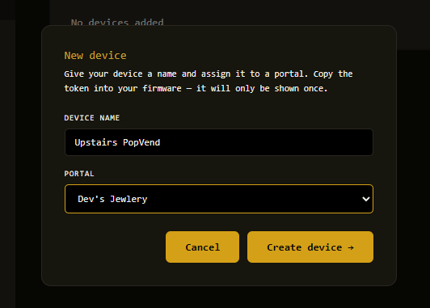
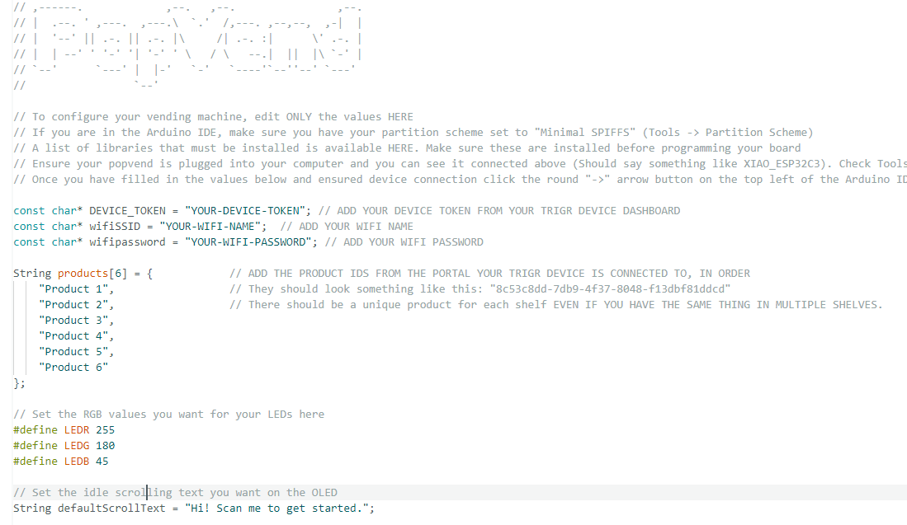
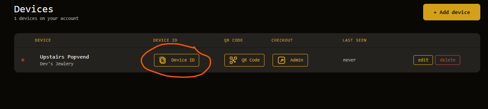

# PopVend
PopVend is a 3D-printed mini vending machine that uses a Trigr.dev QR code to accept instant card payments.

## Features

* 6 unique item slots that can fit things about the height and length of a credit card
* Fully electronic and automatic vending
* Small front screen with customizable scrolling idle text
* Customizable RGB LEDs above each product
* QR code payments using [Trigr.dev](https://trigr.dev) - Triggers vends instantly after online payments, and payment goes instantly to your own Stripe account  

To print the parts you will need access to a 3D printer that can print up to 250mm high and 142mmx215mm.

**The full build is designed for makers that have some knowledge of electronics, soldering skills and a basic understanding of the Arduino IDE.** As of right now, there are only unsoldered boards available on my [Ko-fi page](https://ko-fi.com/devmode). However, pre-soldered circuit boards and some helpful kits will be available soon that will make the build much much easier. 

## How To Build

Full build tutorial coming soon

## How to use Stripe and Trigr for QR code payments

Once your vending machine is all put together and working, it's time to get it set up to vend automatically with Stripe payments. Luckily, this is made very easy with [Trigr.dev](https://trigr.dev) . 

### Step 1: Make a Trigr account & connect your Stripe account

First, [create an a free account on Trigr](https://trigr.dev/auth/register). Once your account is set up, you will need to follow the instructions to verify your email. Once your email has been verified, you can onboard your Stripe account. To onboard your Stripe account, click the yellow start button at the top of your Trigr dashboard:

This will launch the official Stripe onboarding process. If you already have Stripe account that you want to use, that's okay, use that information and it will make onboarding faster.

Sometimes it takes a few hours for your info to be processed and approved. You can check your Stripe connection status on your "Account" tab:

### Step 2: Create your Checkout Portal and get your Device token

Next, click on the "Portals" tab in your Trigr dashboard, and click "+ New Portal". This is where you will specify which products you are selling in your vending machine. 

Add a product for ALL 6 shelves in the machine, even if they are the same product.

Once your portal is made, go to the "Devices" tab to create your device. During device creation, use the "portal" dropdown to select the portal you just created.

Once that is done, your Trigr portal is all set up to accept payments from your vending machine. However, keep this page open because you will need it one more time in the final step.

### Step 3: Copy your Trigr tokens into your firmware, and print your QR code

Just a few more things before you're ready to display your machine.

First, you will need to copy some of the tokens that are now available in your Trigr account into your Arduino firmware to flash onto your esp32. Directly at the top of the Arduino firmware provided in '/firmware' are a bunch of configurable parameters to customize your vending machine: 

Here you can customize the LED colors and the scroll text, as well as set up your WiFi credentials and Trigr tokens.

To get your Trigr device token, go back to the "Devices" tab on your Trigr dashboard. Just click on the "Copy Device ID" button and paste it into the Arduino IDE:

Next, **you will need to add a token for each SHELF in the vending machine (each token should be unique, even if you are selling the same thing on multiple shelves...** just make a separate product for each shelf). To do that, go back to the "Portals" tab and find the portal you set up with your products. There is a "Copy" button displayed next to each product in the portal. There should always be six of these when setting up a PopVend. Copy each one over to the firmware, replacing the text between the quotations marks on lines 19 through 24.

And that's it! Once you re-flash your board with that firmware, you should see the device come online on your Trigr portal. To test your machine, go back to the "Devices" tab and click the "Admin" button on your device. This will take you to a checkout page similar to what a customer will see when they scan your device QR code. Here, you can click on each product and simulate a payment going through by clicking "Trigger Payment Confirmed".

One last thing you'll want to do is go back to the "Devices" tab and click the "QR code" button. This will generate a QR code specifically for your device that you can download to print and mount on your vending machine.

---
*Created by [Devmode](https://www.devinjames.tech/). Need help with your build? Join the [Discord server](https://discord.gg/Y6D79bpH)!