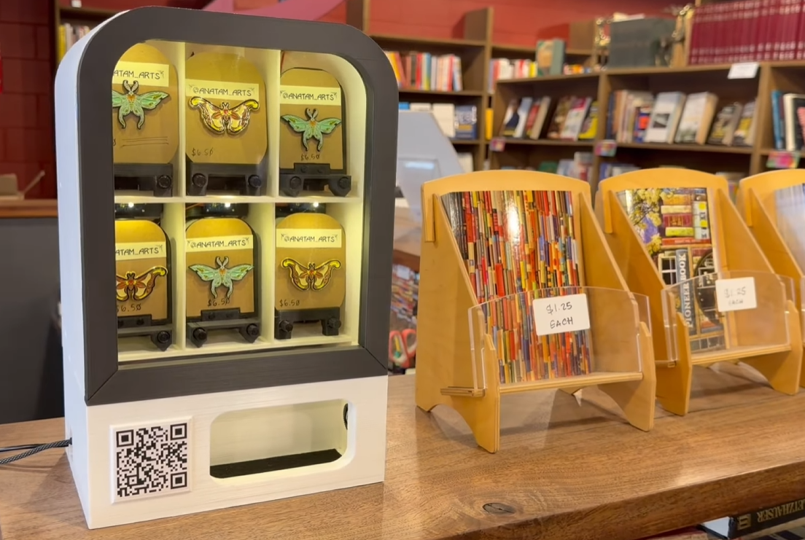

# PopVend
PopVend is a 3D printed mini vending machine that uses a trigr.dev QR code to accept instant card payments.

## Features

* 6 unique item slots that can fit things about the height and length of a credit card.
* Fully electronic and automatic vending
* Small front screen with customizable scolling idle text
* Customizable RGB LEDs above each product
* QR code payments using [trigr.dev](https://trigr.dev) - Triggers vends instantly after online payments, and payment go instantly to your own stripe account  

To print the parts you will need access to a 3D printer that can print up to 250mm high and 142mmx215mm

The full build is designed for makers that have some knowledge of electronics, soldering skills and a basic understanding of the Arduino IDE. However, pre soldered circuit boards and some helpful kits will be available on my [kofi page](https://ko-fi.com/shop/settings?src=sidemenu&productType=0) that will make the build much much easier.

## How To Build

Full build tutorial coming soon

## How to use Trigr for QR code instant payments

Full Trigr integation tutorial coming soon

